# 🏗️ Arquitectura de Módulos - Diagramas

## 📊 Diagrama de Dependencias

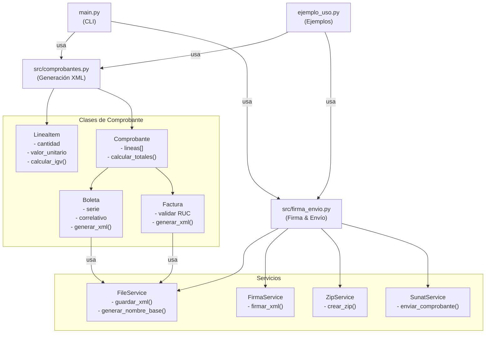

---

## 🔄 Flujo de Procesamiento

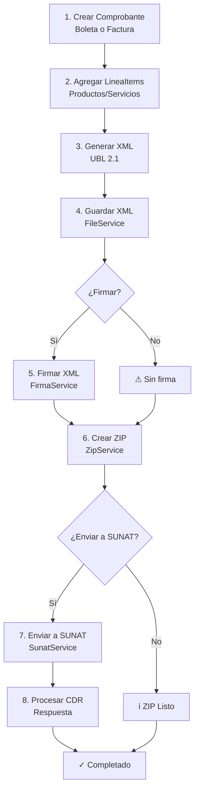

---

## 📦 Estructura de Clases

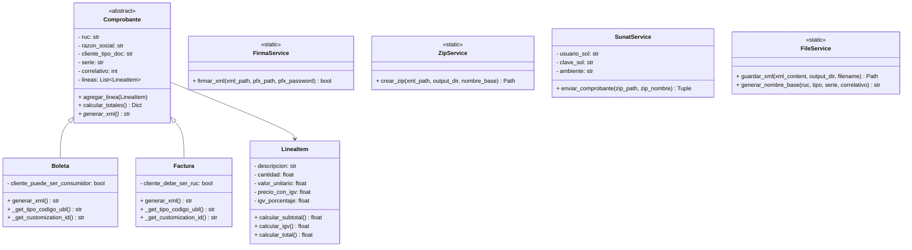

---

## 🔗 Flujo de Datos

```mermaid
graph LR
    A["Datos de Entrada<br/>RUC, Cliente, Items"]
    B["Boleta/Factura<br/>Objeto"]
    C["XML String<br/>UBL 2.1"]
    D["Archivo .xml<br/>Sin firmar"]
    E["Archivo .xml<br/>FIRMADO"]
    F["Archivo .zip<br/>Comprimido"]
    G["SUNAT<br/>Envío"]
    H["CDR ZIP<br/>Respuesta"]
    I["Archivos CDR<br/>Procesados"]
    
    A -->|Crear| B
    B -->|Generar| C
    C -->|Guardar| D
    D -->|Firmar| E
    E -->|Comprimir| F
    F -->|Enviar| G
    G -->|Respuesta| H
    H -->|Extraer| I
    
    style A fill:#e1f5ff
    style B fill:#fff3e0
    style C fill:#f3e5f5
    style D fill:#fce4ec
    style E fill:#e8f5e9
    style F fill:#fff9c4
    style G fill:#ffebee
    style H fill:#ede7f6
    style I fill:#e0f2f1
```

---

## 📋 Casos de Uso

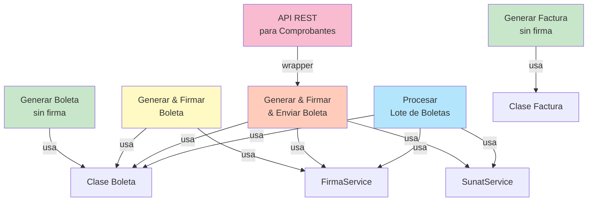

---

## 🏢 Configuración de Ambiente

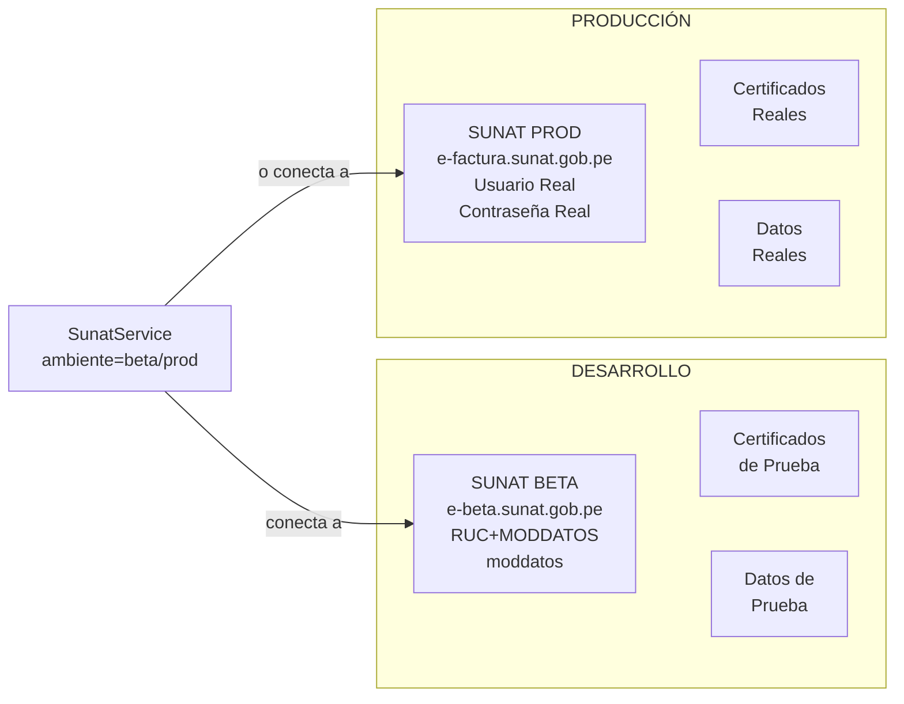

---

## 📊 Comparación: Antes vs Después

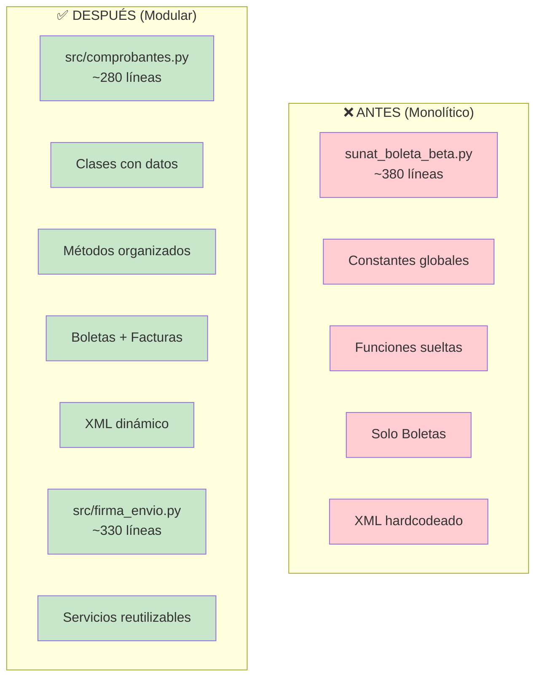

---

## 🎯 Capas Lógicas

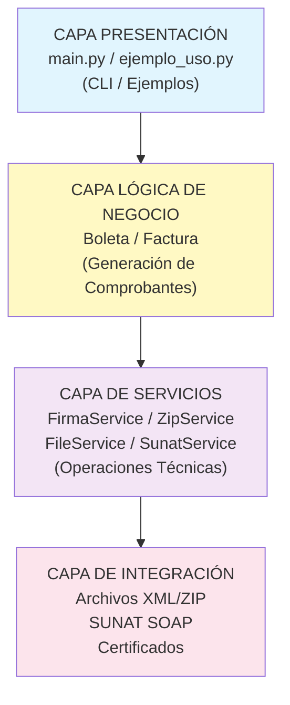

---

## 📈 Escalabilidad: Agregar Nuevo Tipo

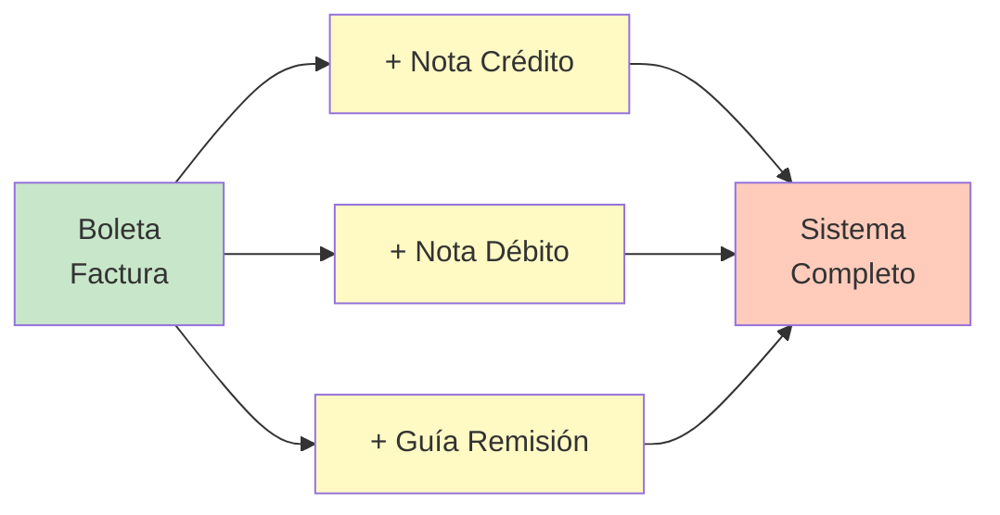

---

## 🔐 Flujo de Seguridad

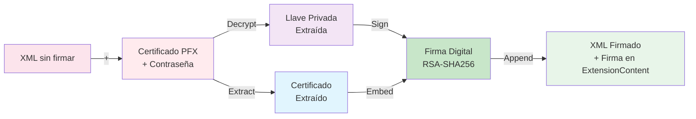

---

## 📞 Integración con SUNAT

```mermaid
graph LR
    ZIP["Archivo ZIP<br/>con XML Firmado"]
    SOAP["Mensaje SOAP<br/>sendBill"]
    AUTH["Autenticación<br/>Usuario + Contraseña"]
    SEND["Envío HTTP POST"]
    SUNAT["SUNAT<br/>BETA/Producción"]
    RESPONSE["Respuesta SOAP<br/>applicationResponse"]
    CDR["CDR ZIP<br/>Comprimido"]
    EXTRACT["Extraer &<br/>Procesar"]
    
    ZIP --> SOAP
    SOAP --> AUTH
    AUTH --> SEND
    SEND --> SUNAT
    SUNAT --> RESPONSE
    RESPONSE --> CDR
    CDR --> EXTRACT
    
    style ZIP fill:#fce4ec
    style SOAP fill:#f3e5f5
    style AUTH fill:#e1f5fe
    style SEND fill:#fff9c4
    style SUNAT fill:#ffccbc
    style RESPONSE fill:#c8e6c9
    style CDR fill:#e8f5e9
    style EXTRACT fill:#e0f2f1
```

---

## 🚀 Ciclo de Vida de un Comprobante

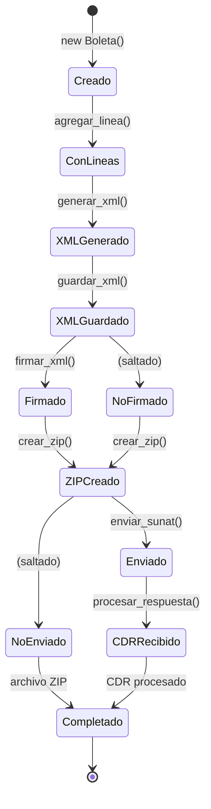

---

## 📚 Dependencias de Librerías

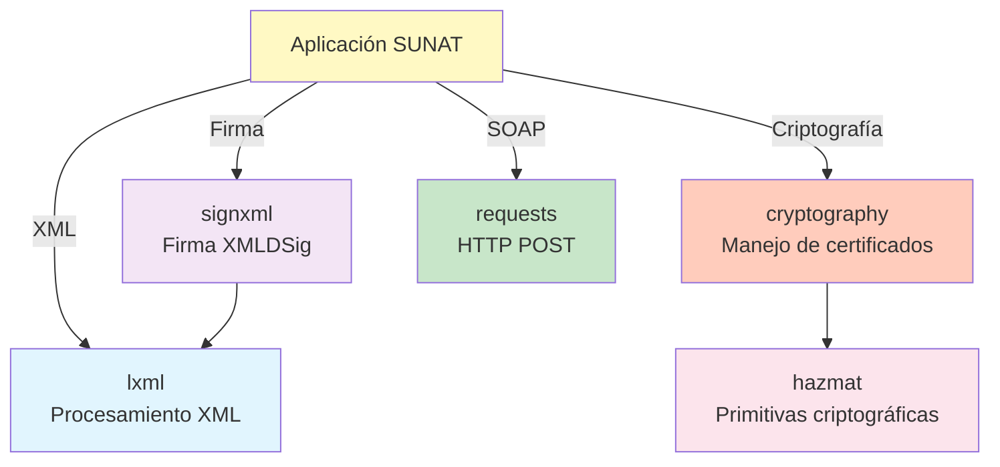

---

## 🎓 Patrones de Diseño Utilizados

```mermaid
graph LR
    Strategy["STRATEGY<br/>FirmaService / ZipService<br/>pueden cambiarse"]
    
    Template["TEMPLATE METHOD<br/>Comprobante.generar_xml()<br/>define estructura,<br/>subclases implementan"]
    
    Factory["FACTORY<br/>FileService.generar_nombre_base()<br/>crea nombres]
    
    Composite["COMPOSITE<br/>Comprobante contiene<br/>LineaItems"]
    
    State["STATE<br/>Comprobante: creado,<br/>con_lineas, firmado, enviado"]
    
    style Strategy fill:#fff9c4
    style Template fill:#e1f5fe
    style Factory fill:#c8e6c9
    style Composite fill:#f3e5f5
    style State fill:#ffccbc
```

